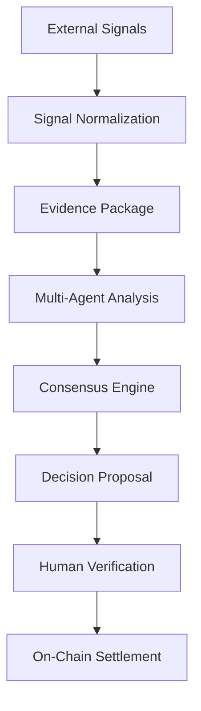

# Nexa AI: System Architecture
### Your AI Agent for Crypto Intelligence, Token Research, and Market Insights.

---

## 1. High-Level Architecture

Nexa AI is an AI-powered crypto intelligence agent that decouples off-chain cognitive agent consensus from immutable smart contract settlement. It executes an 8-stage unified lifecycle to transform unstructured external signals into cryptographically anchored execution outputs on-chain:

---

## 2. Five-Layer Technical Stack

### A. Cognitive Layer (AI Agent Engine)
- **Signal Ingestion**: Aggregates real-world signals from CoinGecko, HackerNews, Reddit, and ESPN.
- **Provider Abstraction**: Interoperable support for OpenAI (GPT-4o), Anthropic (Claude 3.5), Google Gemini (2.5 Flash), OpenRouter, and local Llama 3 models via Ollama.
- **Multi-Agent Evaluation Swarm**:
  - **Research Agent** (`AnalystAgent`): Probability modeling and trend signal extraction.
  - **Market Intelligence Agent** (`MarketIntelAgent`): Cross-chain data feed verification, oracle integrity, and market telemetry.
  - **Risk Agent** (`RiskAgent`): Volatility metrics, liquidity depth, and order book safeguards.

### B. Review & Consensus Engine
- **Weighted Quorum**: Combines independent agent votes scaled by their dynamic reputation weights.
- **66% Approval Quorum**: Proposals must achieve >66% weighted confidence to pass approval.
- **Interactive Debate Swarm**: Sequential multi-turn challenge loop where Risk and Market Intelligence audit the Research Agent before locking consensus.

### C. Evidence & Storage Layer
- **Deterministic Key Sorting**: Sorts JSON keys alphabetically prior to hashing.
- **SHA-256 Content-Addressed Hash**: Tamper-proof evidence payload fingerprint.
- **IPFS Pinning**: Evidence packages pinned to IPFS, returning a Content Identifier (CID) referenced on-chain.

### D. Settlement Layer (Smart Contracts)
- **Smart Contract**: Modular Solidity 0.8.24 (`AiraMarketProtocol.sol`) deployed across EVM networks (`0xDD277CCB8cDa72D652CdcA4df09df5f2522fc846`).
- **Optimistic Oracle**: 24-hour dispute resolution window before automated payout settlement.

### E. Application Layer (React Dashboard)
- **9 UI Modules**: Home, AI Chat, Market Intelligence, Token Intelligence, Risk Analysis, AI Lab, Transparency, Agent Registry, and Portfolio.

---

## 3. Multi-Chain Settlement Architecture

Nexa AI features a modular, chain-agnostic settlement architecture compatible with Ethereum, EVM Layer-2 networks, and testnets:
- **Low Gas Fees**: Micro-seed deposits and market resolution calls execute at minimal cost across L2 rollups.
- **Fast Block Confirmations**: Sub-second block times ensure responsive transaction feedback for user interactions.
- **Verifiable On-Chain Ledger**: Immutable state logs complement off-chain AI reasoning for 100% public auditability.
