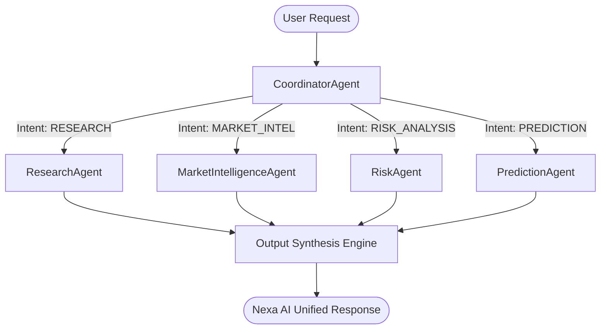

# AI Orchestration & Multi-Agent Architecture

## 1. Executive Overview

Nexa AI implements a 5-agent internal orchestration architecture. While end-users interact with a single unified **Nexa AI** agent persona, requests are routed and processed under the hood by specialized autonomous agents led by the **CoordinatorAgent**.

---

## 2. Agent Roles & Responsibilities

### A. CoordinatorAgent (`CoordinatorAgent.ts`)
- **Role**: Master Orchestrator & Request Router.
- **Responsibilities**:
  - Classifies user request intent into `RESEARCH`, `MARKET_INTELLIGENCE`, `RISK_ANALYSIS`, `PREDICTION_GENERATION`, or `GENERAL_QUERY`.
  - Dispatches tasks to appropriate specialized agents.
  - Aggregates sub-agent reports into a single, polished response under the Nexa AI identity.

### B. ResearchAgent (`ResearchAgent.ts`)
- **Role**: Token Research & Fundamental Analysis.
- **Responsibilities**:
  - Analyzes asset tokenomics, growth drivers, developer activity, and token emission schedules.
  - Evaluates fundamental market cap positioning and project utility.

### C. MarketIntelligenceAgent (`MarketIntelligenceAgent.ts`)
- **Role**: Market Intelligence & Signal Streams.
- **Responsibilities**:
  - Processes real-time price feeds, volume movements, news sentiment, and social telemetry.
  - Generates sentiment scores (0.0 to 1.0) and identifies primary market drivers.

### D. RiskAgent (`RiskAgent.ts`)
- **Role**: Risk Scoring & Volatility Audit.
- **Responsibilities**:
  - Calculates downside volatility index scores (0 to 100).
  - Audits liquidity depth, order book safeguards, and regulatory risk factors.
  - Provides risk-adjusted position sizing recommendations.

### E. PredictionAgent (`PredictionAgent.ts`)
- **Role**: Prediction Generation & Evidence Packaging.
- **Responsibilities**:
  - Formulates binary verifiable prediction questions.
  - Structures evidence payloads for IPFS storage and calculates consensus confidence.
  - Prepares settlement formats for smart contract resolution.

---

## 3. Intent Routing Logic Matrix

| User Query Pattern | Classified Intent | Dispatched Sub-Agents |
|:---|:---|:---|
| *"Research SUI tokenomics & growth drivers"* | `RESEARCH` | `ResearchAgent`, `MarketIntelligenceAgent`, `RiskAgent` |
| *"Explain today's crypto market overview"* | `MARKET_INTELLIGENCE` | `MarketIntelligenceAgent`, `ResearchAgent` |
| *"Should I buy BTC? What are the risks?"* | `RISK_ANALYSIS` | `RiskAgent`, `MarketIntelligenceAgent` |
| *"Generate prediction proposal for AI sector"* | `PREDICTION_GENERATION` | `PredictionAgent`, `RiskAgent` |

---

## 4. Privacy & User Interface Guarantees

- **Single Persona**: The user interface presents a unified **Nexa AI** response. Sub-agent names and intermediate data structures are logged internally for auditing but abstracted from the core user chat interface.
- **Inspectable Logs**: Developers can inspect detailed sub-agent outputs via the AI Transparency Dashboard (`/transparency`).
