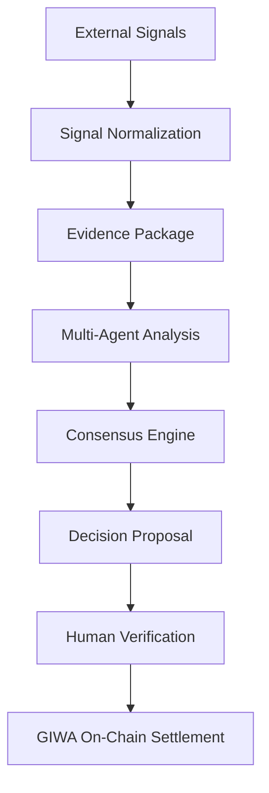

# System Architecture Overview
### Transparent AI Decisions. Verifiable on GIWA.

---

## 1. High-Level Architecture Design
Nexa AI is a general-purpose, verifiable AI decision layer that decouples off-chain cognitive processing from immutable blockchain settlement:
*   **Off-Chain Cognitive Processing**: The Ingestion Feed gathers real-world signals, compiling them into **Evidence Packages** which are audited via Multi-Agent Analysis in the Multi-Agent Consensus Engine.
*   **On-Chain State Settlement**: Smart contracts govern all custody, tokens, and payouts. This guarantees safety of user funds even if the off-chain system experiences downtime.

Nexa AI is governed by an 8-stage unified lifecycle:

---

## 2. Service Boundaries & Responsibilities

### I. Data Ingestion & Evidence Layer Service
*   **Responsibility**: Queries raw APIs (Reddit, Hacker News, ESPN, CoinGecko), normalizes JSON payloads, and builds **Evidence Packages** (linking normalized signal feeds, source metadata, timestamps, and confidence inputs).
*   **Boundary**: Inputs: external endpoints. Outputs: structured Evidence Packages stored in the database cache.
*   **Rationale**: Ensures all decision proposals have an immutable record of primary source evidence before agent evaluations.

### II. AI Sentiment Service
*   **Responsibility**: Analyzes sentiment vectors on Evidence Packages and structures binary decision proposals.
*   **Boundary**: Inputs: Evidence Packages. Outputs: structured decision proposal objects.
*   **Rationale**: Translates qualitative source texts and metadata into quantitative risk parameters.

### III. Multi-Agent Consensus Engine
*   **Responsibility**: Performs Multi-Agent Analysis, evaluating semantic alignment, checking temporal feasibility, assessing content safety, and verifying consensus thresholds.
*   **Boundary**: Inputs: structured proposals and Evidence Packages. Outputs: consensus-approved proposals.
*   **Rationale**: Prevents weak, insecure, or policy-violating proposals from reaching execution pipelines.

### IV. Smart Contracts
*   **Responsibility**: Core state registry, pool distributions, and final settlement on the GIWA Network.
*   **Boundary**: Inputs: signed transactions verified by admin keys. Outputs: state logs and transaction receipts.
*   **Rationale**: Serves as the ultimate trust anchor for user capital.

### V. Indexer & SQL Cache
*   **Responsibility**: Stateless polling of EVM block receipts and caching events to a PostgreSQL DB.
*   **Boundary**: Inputs: RPC log events. Outputs: relational database states queried by the UI.
*   **Rationale**: Prevents heavy RPC querying from the frontend dashboard.

---

## 3. Flagship Contract Deployments

Smart contract interactions dynamically target these deployed network instances:

*   **GIWA Sepolia Testnet** (`Chain ID: 91342`):
    *   **Registry Address**: [`0xDD277CCB8cDa72D652CdcA4df09df5f2522fc846`](https://sepolia-explorer.giwa.io/address/0xDD277CCB8cDa72D652CdcA4df09df5f2522fc846)
    *   **Status**: [LIVE] Verified on Explorer

