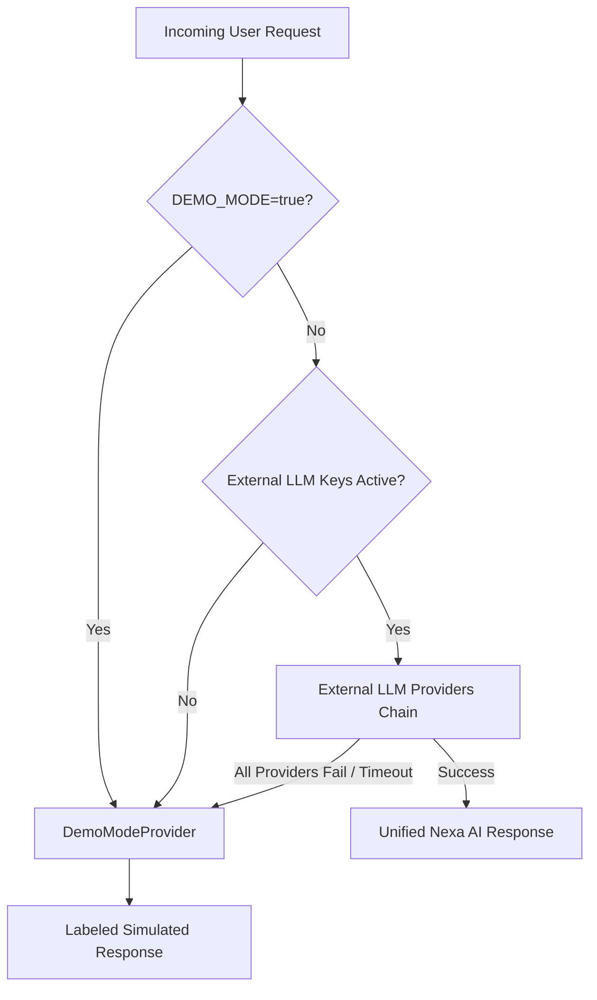

# Demo Mode & Offline Fallback Architecture

## 1. Executive Overview

Nexa AI features an environment-controlled **Demo Mode Engine** (`DemoModeProvider.ts`). It guarantees system availability, zero application crashes, and realistic user experiences even when external LLM providers (OpenAI, Anthropic, Gemini, OpenRouter) or market APIs are unavailable or unconfigured.



---

## 2. Environment Configuration

Demo Mode can be explicitly forced in `.env` or enabled automatically:

```env
# Force Demo Mode explicitly (ideal for hackathons, offline demos, or presentations)
DEMO_MODE=true
VITE_DEMO_MODE=true
```

### Activation Triggers:
1. **Explicit Flag**: `DEMO_MODE=true` set in environment variables.
2. **Missing API Keys**: Zero active LLM provider keys (`OPENAI_API_KEY`, etc.) configured.
3. **Provider Outages / Rate Limits**: All active API provider attempts encounter errors (HTTP 429 rate limit, 500 server error, network drop, or 5s execution timeout).

---

## 3. Response Schema & Labeling Rules

All responses generated under Demo Mode are clearly labeled:

- **Reasoning Prefix**: `[SIMULATED DEMO RESPONSE] Multi-agent consensus evaluated signal patterns...`
- **Summary Tag**: `[SIMULATED DEMO RESPONSE] Comprehensive multi-agent analysis...`
- **Evidence Bullet Tags**: `[SIMULATED DEMO RESPONSE] On-chain active address growth increased...`

### Payload Schema:
```json
{
  "decision": "APPROVE",
  "confidence": 0.92,
  "reasoning": "[SIMULATED DEMO RESPONSE] Multi-agent consensus evaluated signal patterns...",
  "summary": "[SIMULATED DEMO RESPONSE] Comprehensive multi-agent analysis for signal...",
  "risks": "Short-term market volatility | Staking pool reward rate variance",
  "supportingEvidence": "On-chain active address growth (+18.4%) | Positive institutional inflow momentum",
  "recommendedQuestion": "Will signal target parameters be satisfied within the 24h settlement window?"
}
```

---

## 4. Operational Guarantees

- **Zero Server Crashes**: Unhandled API provider errors are caught gracefully and routed to `DemoModeProvider`.
- **Preserved User UX**: The UI maintains identical chat, risk matrix, token research, and prediction generation flows.
- **Transparent Logging**: All Demo Mode fallback invocations log `[LLM_MANAGER] Serving realistic simulated response` in backend telemetry.
