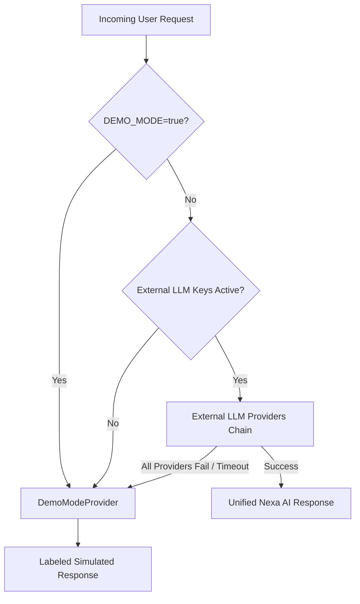

# Demo Mode & Offline Fallback Architecture

## 1. Executive Overview

Nexa AI features an environment-controlled **Demo Mode Engine** (`DemoModeProvider.ts`). It guarantees system availability, zero application crashes, and realistic user experiences even when external LLM providers (OpenAI, Anthropic, Gemini, OpenRouter) or market APIs are unavailable or unconfigured.



---

## 2. Environment Configuration

Demo Mode can be explicitly forced in `.env` or enabled automatically:

```env
# Force Demo Mode explicitly (ideal for hackathons, offline demos, or presentations)
DEMO_MODE=true
VITE_DEMO_MODE=true
```

### Activation Triggers:
1. **Explicit Flag**: `DEMO_MODE=true` set in environment variables.
2. **Missing API Keys**: Zero active LLM provider keys (`OPENAI_API_KEY`, etc.) configured.
3. **Provider Outages / Rate Limits**: All active API provider attempts encounter errors (HTTP 429 rate limit, 500 server error, network drop, or 5s execution timeout).

---

## 3. Response Schema & Labeling Rules

All responses generated under Demo Mode are clearly labeled:

- **Reasoning Prefix**: `[SIMULATED DEMO RESPONSE] Multi-agent consensus evaluated signal patterns...`
- **Summary Tag**: `[SIMULATED DEMO RESPONSE] Executive Summary...`
- **Evidence Bullet Tags**: `[SIMULATED DEMO RESPONSE] On-chain active address growth increased...`

---

## 4. Operational Guarantees

- **Zero Server Crashes**: Unhandled API provider errors are caught gracefully and routed to `DemoModeProvider`.
- **Preserved User UX**: The UI maintains identical chat, risk matrix, token research, and prediction generation flows.
- **Transparent Logging**: All Demo Mode fallback invocations log `[LLM_MANAGER] Serving realistic simulated response` in backend telemetry.

---

## 5. 5 Guided Research Scenarios (<90s Total Duration)

Nexa AI provides 5 pre-configured realistic research scenarios accessible via the Chat interface (`/chat`):

1. **Analyze Ethereum**: L2 TVL ($48.2B ATH), post-Dencun blob volume (+34%), net exchange supply drop (-142k ETH), 96% confidence score.
2. **Research Solana**: Active fee-paying addresses (4.8M+), daily DEX volume ($3.2B+), validator node concentration risks, 92% confidence score.
3. **Evaluate Bitcoin risk**: Spot ETF net inflows ($420M/day), 5-year exchange supply reserve lows, miner hashrate (720 EH/s ATH), 98% confidence score.
4. **Explain today's market**: Global crypto market cap ($3.65T), Fear & Greed Index (78 Greed), AI sector outperformance (+18.2%), 94% confidence score.
5. **Generate prediction opportunity**: Verifiable binary proposal (*Will daily AI agent transaction volume exceed 10M before Q4?*), YES 78% / NO 22% probability.

**Speed Performance**: In Demo Mode, each scenario streams rapidly in under 15 seconds, enabling users and judges to experience all 5 scenarios in under 90 seconds from start to finish.
