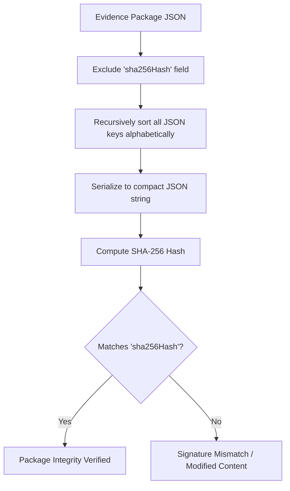

# Evidence Package Verification Guide

This guide details the procedure to verify the cryptographic integrity and deterministic serialization of an **Evidence Package** compiled by Nexa AI.

---

## 1. Evidence Package Schema Reference

Every valid Evidence Package contains the following properties:

| Property | Type | Description |
| :--- | :--- | :--- |
| `normalizedSignal` | `Object` | The input event signal details. |
| `originalSource` | `String` | Originating ingestion source. |
| `agentOutputs` | `Array` | Collation of agent audit votes and confidence. |
| `reasoning` | `String` | Consolidated consensus reasoning. |
| `confidence` | `Number` | Aggregated consensus confidence score. |
| `metadata` | `Object` | Protocol metadata including `protocolVersion`. |
| `modelVersion` | `String` | Model version references. |
| `timestamp` | `String` | Creation date (ISO format). |
| `promptHash` | `String` | SHA-256 hash of prompt directives. |
| `agentIds` | `Array` | Lexicographically sorted list of agent identifiers. |
| `provider` | `String` | IPFS pinning/upload provider used. |
| `cid` | `String` | IPFS Content Identifier (CID). |
| `sha256Hash` | `String` | SHA-256 hash computed over all above fields. |

---

## 2. Deterministic Hash Verification Flowchart



---

## 3. Step-by-Step CLI Verification Procedure

Follow these instructions to verify an Evidence Package manually using Node.js:

1.  **Extract the Package JSON** from the IPFS gateway or local logs (e.g. `Qm...`).
2.  **Save the payload** to a file named `package.json`.
3.  **Run this Node.js script** to verify the deterministic SHA-256 hash:

```javascript
const fs = require('fs');
const crypto = require('crypto');

// 1. Load the Evidence Package
const rawData = fs.readFileSync('package.json', 'utf8');
const pkg = JSON.parse(rawData);

const originalHash = pkg.sha256Hash;

// 2. Exclude the 'sha256Hash' property to isolate the hashing target
const { sha256Hash, ...hashTarget } = pkg;

// 3. Recursively sort all object keys alphabetically
function serialize(obj) {
    if (obj === null || obj === undefined) return '';
    if (typeof obj !== 'object') return JSON.stringify(obj);
    if (Array.isArray(obj)) {
        return JSON.stringify(obj.map(item => serializeToObj(item)));
    }
    return JSON.stringify(serializeToObj(obj));
}

function serializeToObj(obj) {
    if (typeof obj !== 'object' || obj === null) return obj;
    if (Array.isArray(obj)) return obj.map(item => serializeToObj(item));
    const sortedObj = {};
    Object.keys(obj).sort().forEach(key => {
        sortedObj[key] = serializeToObj(obj[key]);
    });
    return sortedObj;
}

// 4. Serialize the sorted object
const serialized = serialize(hashTarget);

// 5. Generate and compare the SHA-256 hash
const calculatedHash = crypto.createHash('sha256').update(serialized).digest('hex');

console.log(`Original Hash:   ${originalHash}`);
console.log(`Calculated Hash: ${calculatedHash}`);

if (calculatedHash === originalHash) {
    console.log("SUCCESS: Cryptographic verification passed! Package is authentic and unmodified.");
    process.exit(0);
} else {
    console.log("FAIL: Cryptographic verification failed! Content has been tampered with.");
    process.exit(1);
}
```

---

## 4. IPFS CID Retrieval Validation

To verify the IPFS location of the package:
1.  Verify that the CID string conforms to the `Qm...` (CIDv0) or `bafy...` (CIDv1) regex format:
    ```regex
    /^(Qm[1-9A-HJ-NP-Za-km-z]{44}|bafy[a-z0-9]{55,59})$/
    ```
2.  Query a public gateway to retrieve the content:
    ```bash
    curl https://ipfs.io/ipfs/<CID_HERE>
    ```
3.  Ensure the returned JSON is identical to the locally archived file.
