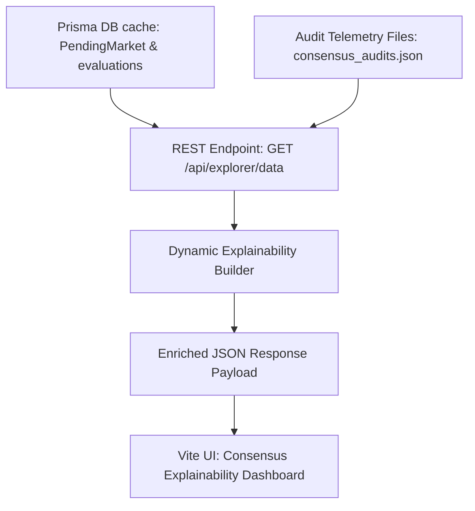

# Protocol Explainability Guide

This guide documents the design, attributes schema, and visual components representing the **Consensus Explainability Pipeline** in Nexa AI.

---

## 1. High-Level Data Flow

Explainability details are generated dynamically from database indexes and file-system logs on API query request:

---

## 2. Explainability Schema Attributes

Every proposal served to the frontend includes these compiled explainability fields:

*   `decisionReason`: String summary explaining why consensus was approved or rejected against thresholds ($S_w \ge 0.66$, $C_w \ge 0.75$).
*   `disagreements`: Array of strings capturing dissenting agent names, votes, and confidence.
*   `riskAssessment`: Aggregated audit logs detailing risk summaries and weight constraints from `RiskAgent` and `ComplianceAgent`.
*   `supportingEvidence`: Topic, category, and expire coordinates matching the raw signal origin.

---

## 3. UI Tab Mappings

The Protocol Explorer implements a dashboard with four tabs:

1.  **Consensus Explainability**:
    *   *Verdict Banner*: Dynamic green (approved) or red (rejected) alerts showing verdict summaries.
    *   *Agent Dissents Log*: Displays gavel symbols for dissenting agents or ticks for unanimous quorums.
    *   *Assessment Cards*: Displays raw quote text from agent evaluations.
2.  **Confidence Distribution**:
    *   Horizontal progress bars mapping raw and reputation-adjusted confidence scores side-by-side.
3.  **Supporting Evidence**:
    *   Exposes original sources, timestamps, and IPFS CIDs.
4.  **On-Chain Registry**:
    *   Lists on-chain transaction hash links to explorer.
