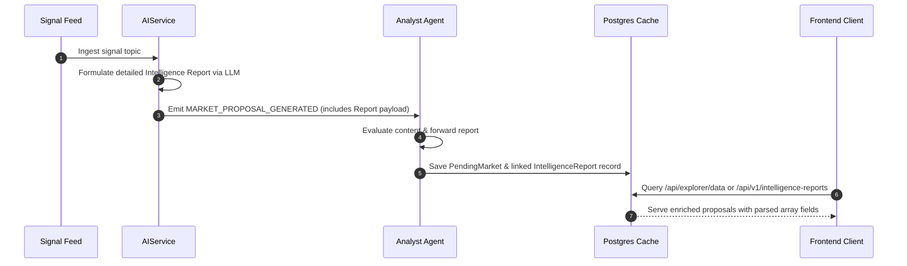

# Verifiable AI Intelligence Reports Architecture
### Establishing Trust through Explanatory Reasoning & Structured Evidence

---

## 1. System Overview

Traditional AI decision layers and prediction protocols suffer from an "explainability deficit" by outputting single binary states or simple confidence percentages. Nexa AI resolves this by requiring every decision proposal to be backed by a structured, auditable **Intelligence Report**.

Instead of a black-box decision flow:
```
Signal ──► Decision
```

The Nexa AI platform executes a multi-stage cognitive pipeline:
```
Signal ──► Evidence Ingestion ──► Sentiment reasoning ──► Counter-Arguments ──► Quorum consensus ──► Decision
```

---

## 2. Core Schema Specification

The intelligence reports are defined by the standard JSON Schema located in [schema.json](file:///home/oyeolorun/AiraMarKet/server/services/intelligence_report/schema.json). Each report contains the following fields:

| Field | Type | Description |
| :--- | :--- | :--- |
| `signalId` | `string` | Unique identifier linking back to the primary real-world signal. |
| `summary` | `string` | High-level synthesis of the signal context and assessment outcome. |
| `supportingEvidence` | `string[]` | Primary source facts and sentiment indicators supporting the recommendation. |
| `contradictingEvidence` | `string[]` | Potential dissenting arguments or mitigating factors identified during reasoning. |
| `confidence` | `number` | Float score (0.0 to 1.0) indicating LLM confidence. |
| `riskFactors` | `string[]` | Identified compliance, temporal, or operational risk items. |
| `reasoning` | `string` | Complete explanatory text detailing why the decision was reached. |
| `recommendedDecision` | `string` | Final recommendation verdict (`APPROVE` or `REJECT`). |

---

## 3. Database Modeling & Persistence

Intelligence reports are stored off-chain in the PostgreSQL database cache. This isolates heavy text data from smart contract storage fees while keeping it fully public and auditable via REST APIs.

The relation is modeled in [schema.prisma](file:///home/oyeolorun/AiraMarKet/prisma/schema.prisma) as a 1-to-1 relationship with `PendingMarket`:

```prisma
model PendingMarket {
  id                 Int                 @id @default(autoincrement())
  signalId           String              @unique
  title              String
  ...
  intelligenceReport IntelligenceReport?
}

model IntelligenceReport {
  id                    Int           @id @default(autoincrement())
  pendingMarketId       Int           @unique
  pendingMarket         PendingMarket @relation(fields: [pendingMarketId], references: [id], onDelete: Cascade)
  signalId              String        @unique
  summary               String
  supportingEvidence    String        // JSON array represented as string
  contradictingEvidence String        // JSON array represented as string
  confidence            Float
  riskFactors           String        // JSON array represented as string
  reasoning             String
  recommendedDecision   String
  createdAt             DateTime      @default(now())
}
```

---

## 4. API Reference

The protocol exposes three new REST endpoints on the primary backend server:

### I. Get All Intelligence Reports
* **URL**: `/api/v1/intelligence-reports`
* **Method**: `GET`
* **Response**: `200 OK` (Array of parsed Intelligence Reports)

### II. Get Report by Signal ID
* **URL**: `/api/v1/intelligence-report/:signalId`
* **Method**: `GET`
* **Response**: `200 OK` (Single report object) or `404 Not Found`

### III. Save New Report
* **URL**: `/api/v1/intelligence-report`
* **Method**: `POST`
* **Content-Type**: `application/json`
* **Body**: Full JSON payload matching the `IntelligenceReport` schema.
* **Response**: `201 Created`

---

## 5. Architectural Pipeline Flow


