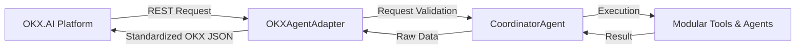

# OKX.AI Agent Service Provider Integration

## 1. Executive Overview

Nexa AI is configured for submission as an **OKX.AI Agent Service Provider**. To maintain architectural integrity and prevent tight coupling to platform-specific specifications, all OKX integration handlers are isolated inside an adapter layer (`OKXAgentAdapter.ts`).



---

## 2. Public API Endpoints Reference

Nexa AI exposes four public REST API endpoints for OKX agent service provider verification:

### A. Health Check (`GET /api/v1/okx/health`)
- **Description**: Returns real-time system health and service uptime.
- **Response Example**:
```json
{
  "status": "OK",
  "service": "Nexa AI OKX Agent Provider",
  "uptimeSeconds": 1420,
  "timestamp": 1720000000000
}
```

### B. Version Endpoint (`GET /api/v1/okx/version`)
- **Description**: Returns API versioning and build metrics.
- **Response Example**:
```json
{
  "name": "Nexa AI",
  "version": "1.0.0",
  "apiVersion": "v1",
  "build": "v1.0.0-stable",
  "environment": "Development"
}
```

### C. Agent Metadata Endpoint (`GET /api/v1/okx/metadata`)
- **Description**: Returns service provider capabilities, supported networks, and registered endpoints.
- **Response Example**:
```json
{
  "name": "Nexa AI",
  "version": "1.0.0",
  "description": "Nexa AI is an AI-powered crypto intelligence agent...",
  "provider": "Nexa AI / OKX AI Agent Service Provider",
  "capabilities": [
    "Token Research & Fundamental Analysis",
    "Real-Time Market Signals & News Telemetry",
    "Risk Scoring & Volatility Audit",
    "Verifiable Prediction Proposals & IPFS Evidence Packaging"
  ],
  "endpoints": {
    "agentQuery": "/api/v1/okx/agent",
    "health": "/api/v1/okx/health",
    "version": "/api/v1/okx/version",
    "metadata": "/api/v1/okx/metadata"
  },
  "supportedNetworks": ["Ethereum", "Arbitrum", "Base", "Optimism", "EVM Testnets"]
}
```

### D. Agent Query Execution Endpoint (`POST /api/v1/okx/agent`)
- **Description**: Primary agent query processing endpoint.
- **Request Body**:
```json
{
  "query": "Analyze Bitcoin sentiment and key risk drivers for Q3",
  "sessionId": "okx-session-99120"
}
```
- **Response Example**:
```json
{
  "success": true,
  "provider": "Nexa AI",
  "version": "1.0.0",
  "sessionId": "okx-session-99120",
  "data": {
    "query": "Analyze Bitcoin sentiment and key risk drivers for Q3",
    "primaryIntent": "RISK_ANALYSIS",
    "aggregatedSummary": "### Nexa AI Intelligence Report for \"Analyze Bitcoin...\"\n...",
    "confidenceScore": 0.94
  },
  "executionTimeMs": 340,
  "timestamp": 1720000000000,
  "error": null
}
```

---

## 3. Operational Protection & Error Handling

- **Request Validation**: Verifies that input payload is valid JSON and contains a non-empty `query` string (<1000 chars).
- **10s Timeout Protection**: Uses `Promise.race` with a 10,000ms threshold to prevent hanging connection states.
- **Standardized Error Codes**:
  - `INVALID_INPUT` (HTTP 400): Missing or malformed query string.
  - `REQUEST_TIMEOUT` (HTTP 504): Processing exceeded 10s cutoff limit.
  - `INTERNAL_ERROR` (HTTP 500): Server-side execution exception.

---

## 4. Verification with Curl

```bash
# Health Check
curl -X GET http://localhost:3000/api/v1/okx/health

# Version Info
curl -X GET http://localhost:3000/api/v1/okx/version

# Metadata
curl -X GET http://localhost:3000/api/v1/okx/metadata

# Execute Query
curl -X POST http://localhost:3000/api/v1/okx/agent \
  -H "Content-Type: application/json" \
  -d '{"query": "Analyze ETH market sentiment", "sessionId": "test-1"}'
```
