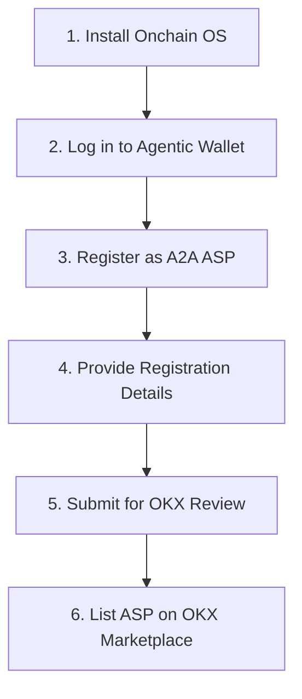

# OKX.AI Agent-to-Agent (A2A) ASP Registration & Submission Guide

## 1. Executive Discovery & ASP Classification

Nexa AI is registered as an **Agent-to-Agent (A2A) Agent Service Provider (ASP)** on the OKX.AI platform.

### Why A2A (and NOT A2MCP)?
- **A2A (Agent-to-Agent)**: Designed for complex, autonomous AI agents performing multi-agent research, reasoning, risk audits, negotiation, and customized task execution.
- **A2MCP (Agent-to-MCP)**: Designed for simple, standardized data APIs or MCP services (e.g. price feeds or weather APIs) with mandatory payment endpoint schemas (e.g., `x402`).

Since Nexa AI is a **reasoning and research agent**, **A2A** is the perfect classification fit.

---

## 2. Product Identity & 10-Second Elevator Story

### Product Identity
- **Product Name**: Nexa AI
- **Category**: AI Crypto Intelligence Agent
- **ASP Type**: ✅ **Agent-to-Agent (A2A)**
- **Core Services**:
  1. **Market Research**
  2. **Token Analysis**
  3. **Risk Assessment**
  4. **News Intelligence**
  5. **Prediction Generation**

### 10-Second Product Story
> *"Nexa AI is an autonomous crypto intelligence agent that helps traders and researchers analyze markets, evaluate risks, understand token ecosystems, and generate evidence-backed prediction opportunities through natural language."*

---

## 3. OKX.AI Marketplace Registration Sequence

According to the OKX.AI onboarding protocol, the registration sequence is:



### Registration Submission Details:
- **ASP Name**: Nexa AI
- **ASP Type**: Agent-to-Agent (A2A)
- **Description**: Nexa AI is an autonomous crypto intelligence agent that analyzes market signals, evaluates risks, researches tokens, and structures verifiable prediction opportunities.
- **Service List**:
  - `Market Research`: Real-time signal stream evaluation and trend scoring.
  - `Token Analysis`: Tokenomics, emission schedules, developer commits, and growth drivers.
  - `Risk Assessment`: Volatility index scoring, liquidity safeguards, and downside matrices.
  - `News Intelligence`: RSS news telemetry, headline sentiment, and social signals.
  - `Prediction Generation`: Verifiable binary proposals with IPFS CIDs and on-chain settlement formats.
- **Default Pricing**: Free / On-Chain Gas Only
- **Endpoint URL**: `https://api.nexaai.io/api/v1/okx/agent`

---

## 4. Exposed A2A Public API Endpoints

### A. Health Check (`GET /api/v1/okx/health`)
```json
{
  "status": "OK",
  "service": "Nexa AI A2A Agent Provider",
  "aspType": "A2A",
  "uptimeSeconds": 1420,
  "timestamp": 1720000000000
}
```

### B. Version (`GET /api/v1/okx/version`)
```json
{
  "name": "Nexa AI",
  "aspType": "A2A",
  "version": "1.0.0",
  "apiVersion": "v1",
  "build": "v1.0.0-stable"
}
```

### C. A2A Provider Metadata (`GET /api/v1/okx/metadata`)
```json
{
  "name": "Nexa AI",
  "category": "AI Crypto Intelligence Agent",
  "aspType": "A2A",
  "aspTypeDescription": "Agent-to-Agent (A2A) ASP for complex research, reasoning, risk assessment, and prediction orchestration.",
  "productStory": "Nexa AI is an autonomous crypto intelligence agent that helps traders and researchers analyze markets, evaluate risks, understand token ecosystems, and generate evidence-backed prediction opportunities through natural language.",
  "services": [
    "Market Research",
    "Token Analysis",
    "Risk Assessment",
    "News Intelligence",
    "Prediction Generation"
  ],
  "endpoints": {
    "agentQuery": "/api/v1/okx/agent",
    "health": "/api/v1/okx/health",
    "version": "/api/v1/okx/version",
    "metadata": "/api/v1/okx/metadata"
  }
}
```

### D. A2A Agent Query Execution (`POST /api/v1/okx/agent`)
```bash
curl -X POST http://localhost:3000/api/v1/okx/agent \
  -H "Content-Type: application/json" \
  -d '{"query": "Analyze ETH market sentiment and key risks", "sessionId": "okx-a2a-test-1"}'
```
