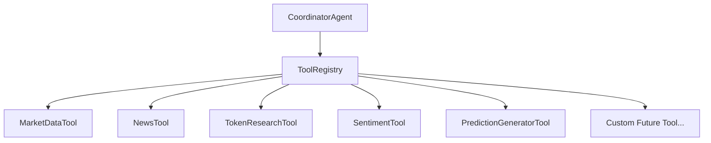

# Pluggable Tool-Calling Layer Architecture

## 1. Executive Overview

Nexa AI features a modular, pluggable **Tool-Calling Layer** that decouples external data fetching and execution logic from the AI orchestration pipeline.

All tools implement the common `ITool` interface and register with the central `ToolRegistry`. Future tools can be plugged in dynamically at runtime or build time without altering existing agent orchestration code.



---

## 2. Common Interface (`ITool.ts`)

Every tool in the system implements the `ITool` interface contract:

```typescript
export interface ToolExecuteContext {
    query: string;
    params?: Record<string, any>;
}

export interface ToolResult<T = any> {
    toolName: string;
    success: boolean;
    data: T;
    timestamp: number;
    error?: string;
}

export interface ITool {
    name: string;
    description: string;
    category: string;
    execute(context: ToolExecuteContext): Promise<ToolResult>;
}
```

---

## 3. Core Pluggable Tools Reference

| Tool Name | Class | Category | Primary Function |
|:---|:---|:---|:---|
| **MarketDataTool** | `MarketDataTool.ts` | Market Data | Real-time prices, 24h volume, DEX liquidity depth & TVL. |
| **NewsTool** | `NewsTool.ts` | Market Intelligence | Aggregates breaking news, RSS feeds & developer notes. |
| **TokenResearchTool** | `TokenResearchTool.ts` | Token Research | Tokenomics, emission schedules & GitHub activity. |
| **SentimentTool** | `SentimentTool.ts` | Sentiment Analytics | Weighted social sentiment indices & Fear/Greed ratio. |
| **PredictionGeneratorTool** | `PredictionGeneratorTool.ts` | Prediction Engine | Binary prediction questions & IPFS evidence CIDs. |

---

## 4. How to Register & Add Future Tools

To add a new tool, implement `ITool` and register it with `ToolRegistry`:

```typescript
import { ITool, ToolExecuteContext, ToolResult, ToolRegistry } from './server/tools';

export class MyCustomOnChainTool implements ITool {
    name = 'MyCustomOnChainTool';
    description = 'Audits smart contract bytecodes and transaction logs';
    category = 'Security';

    async execute(context: ToolExecuteContext): Promise<ToolResult> {
        return {
            toolName: this.name,
            success: true,
            timestamp: Date.now(),
            data: { bytecodeVerified: true, contractAge: '140 days' }
        };
    }
}

// Register tool dynamically (zero changes needed in CoordinatorAgent!)
ToolRegistry.registerTool(new MyCustomOnChainTool());
```

---

## 5. Tool Discovery & Execution API

```typescript
// List all registered tools
const activeTools = ToolRegistry.listTools();

// Execute a tool safely
const result = await ToolRegistry.executeTool('MarketDataTool', { query: 'ETH' });
```
